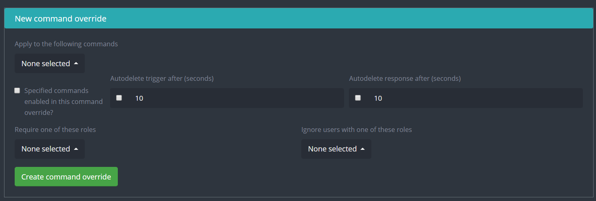
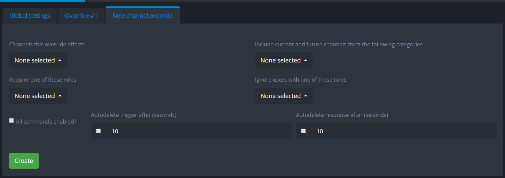

# Command Settings

## Préfixe

Le préfixe par défaut est `-` La première chose que vous voyez en ouvrant la page des commandes est le préfixe, vous pouvez le remplacer avec le votre si vous le souhaitez. Assurez vous de sauvegarder en appuyant sur le bouton "Save". Seules les commandes ont un préfixe désigné (pas les commandes personnalisées ni les commandes slash)


_Les paramètres de commande_ ne sont pas affectés par les préfixes. Par exemple, la commande `rolemenu create` avec le préfixe `+`, ce sera`+rolemenu create (group name) -m (message id)`. Notez que nous avons utilisé le préfixe `+` mais que `-m` est resté `-m`, et n'est pas devenu`+m`.


## Command Override - Paramètres de commande&#x20;

**Apply to the following commands:** Vous pouvez choisir dans ce menu à quelle commande ce paramètre va s'appliquer.

**Specific commands enabled in this command override:** Vous pouvez choisir si vous voulez activer ou non la commande avec ce paramètre. (Activez ceci si vous avez la commande désactivée dans les paramètres globaux)

**Auto delete trigger/response:** Activez pour supprimer le message déclencheur ou le message de réponse et assignez y un temps de latence (entre 1 et 60 secondes).

**Require one of these roles:** Vous pouvez définir une liste de rôles requis pour utiliser la commande (un parmi la liste).

**Ignore users with one of these roles:** Vous pouvez définir une liste de rôles bannis de l'utilisation de la commande.

## Channel Override - Paramètres de salon

**Channels this override affects:** Sélectionnez une liste de salons dans lesquels les paramètres s'appliqueront.

**Include current and future channels from the following categories:** Sélectionnez une liste de catégories, tous les salons de cette catégorie seront affectés par les paramètres (dont ceux qui seront ajoutés plus tard).

**Require one of these roles:** Sélectionnez une liste de rôles requis pour utiliser les commandes.

**Ignore users with one of these roles:** Sélectionnez une liste de rôles qui ne pourront pas utiliser les commandes.

**All commands enabled**: Activez toutes les commandes pour ces paramètres, vous pouvez créer des paramètres de commande pour une personnalisation.

**Auto delete trigger/response:** Activez pour supprimer le message déclencheur ou le message de réponse et assignez y un temps de latence (entre 1 et 60 secondes)..

**New command override:** Créer un paramètre de commande qui s'appliquera dans les salons du paramètre. Pour avoir de l'aide sur la création de paramètre de commande, référez-vouz à la section [#command-override-parametres-de-commande](commands.md#command-override-parametres-de-commande "mention")[.](commands.md#command-override)
