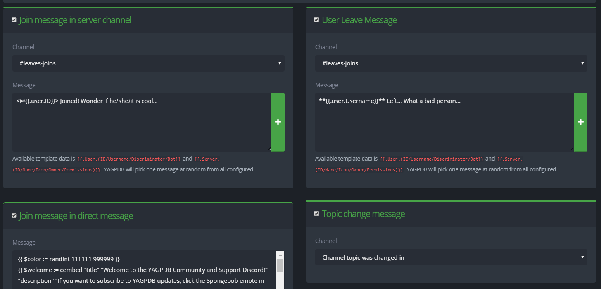

# Flux de notification

## General Feed - Flux général

### Join Message

**Channel:** Choisissez dans quel salon le bot annoncera l'arrivée.\
**Message:** Quel message le bot enverra lors de l'arrivée.

### Leave Message

**Channel:** Choisissez dans quel salon le bot annoncera le départ.\
**Message:** Quel message le bot enverra lors du départ.

### Join Message in Direct Message

Ecrivez un message que vous voulez que le bot envoie à l'utilisateur en privé lorsqu'il rejoint votre serveur.

### Topic Change Message

Choisissez dans quels salons vous voulez que le bot annonce les changements de sujet.


Tous les modèles des commandes personnalisables ne sont pas supportés dans toutes les flux de notification.

