# Automoderator V2


Automod v2 is currently in the beta phase, please report bugs about it on GitHub or Discord



#### Tips

Generally speaking most people want to have "ignore bots" as a ruleset condition, that way bots wont trigger any rules.

A simple way to have it is to keep all the basic stuff \(invites, spam mentions, safebrowsing etc\) in a single rule, then have a single violation counter and a rule for each tier of punishment \(warn, kick, mute, ban\)


## Introduction

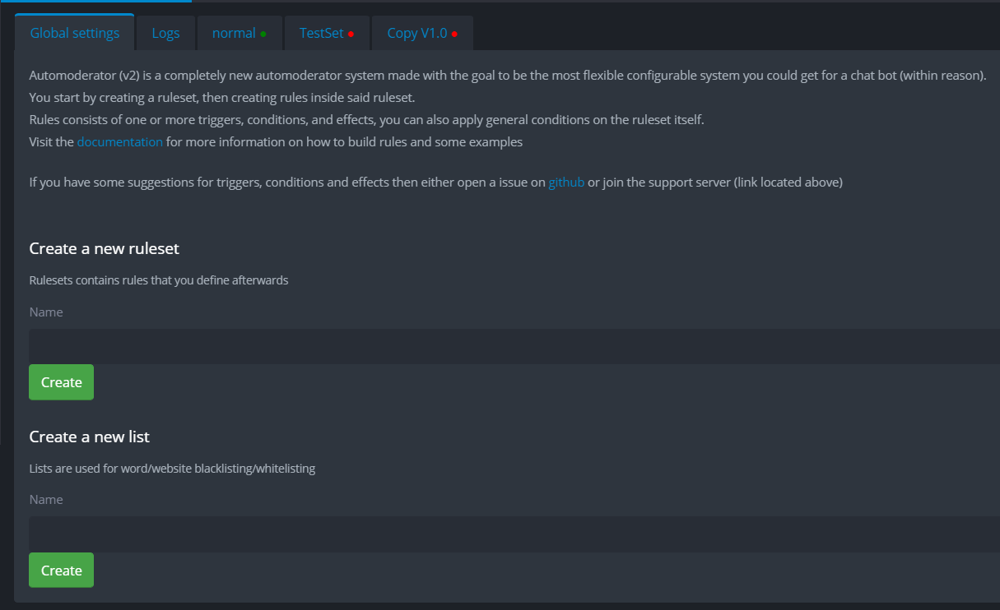

Automod V2 is a completely new auto-moderator system made from the ground up. When starting out you will need to create a new ruleset.

If you'd rather watch a video, we made a short basic intro on [YouTube](%20https://www.youtube.com/watch?v=5dfjYJShzyw​).

#### Rulesets

Rulesets are how you will group your auto moderation rules, you will need one to start out. A ruleset can be toggled on or off in the control panel with the `-automod toggle <ruleset name>` command.

#### List

List is where you will enter a list of words or websites for the auto-moderation system to use such as a list of banned websites/banned words/banned names etc.

#### Logs

Every time a rule is triggered, a log will be posted with the Date, User, Rule, and Trigger that caused it. This is helpful to find out what exactly happened.

## Ruleset Settings

In each rule sets you have several options

* **Name:** You can edit the name of your rule
* **Enable rule set:** You can toggle the rule set on and off 
* **Ruleset scoped condition:** Assigned conditions that will apply to every rule\` in the rule set. 
* **Create a new rule:** Create a new rule in the ruleset

## Rule Setting 

**Triggers:** A variety of different parameters that can configured to trigger the rule. Multiple parameters can be set but only one needs to activate to trigger the rule.   
**Conditions**: Restrictions or parameters set to limit who can trigger the rule. Multiple conditions can be set and all must be valid in order to allow the trigger.  
**Effects**: The effect that the rule will cause. Multiple effects can be added and all of them will be activated whenever the trigger is activated

## Violations 

When you create a violation, you will need to assign it a name. Each violation name will act like a key which has its own separate group with its own separate count. 

**Example:** `+violation` with the name `links` will increment the `links` violation counter for that user.

Then you can set up a rule with the  `x violations in y minutes` trigger so that when someone increments the counter `x times within y minutes`, the rule will trigger. Using this you can set up tiered punishments where repeated violations causes stricter punishments.

## Rule Options

### Trigger Types

#### **All caps**

* Triggers when a message contains more than x% of just capitalized letters.
  * **Min number of all caps:** Min number of caps needed to trigger
  * **Percentage of all caps:** Percent of the message needed to be made up of caps. 
* Both condition needs to be met to cause the trigger. 

#### **Message mentions**

* Triggers when a message includes more than x unique mentions 
  * **Threshold:** The number of unique mentions needed to trigger the rule.

#### **Any links**

* Triggers when a message contains any valid link

#### **X violation in Y minutes**

* Triggers when a user has more than x violations within y minutes.
  * **Violation name:** The violation key that we need to check 
  * **Number of violation:** The "x" number of violation needed to trigger the rule
  * **Within \(minutes\):** The "y" number of minutes that the violation needs to occur within. 
  * **Ignore if a higher violation trigger of this name was activated:**  Will be ignore if another violation trigger was activated that was higher up in punishment. Such as a ban violation if this was a kick violation. 

#### Word blacklist

* Triggers on messages containing words in the specified list
  * **List:** The list you want the rule to check against

#### Word whitelist

* Triggers on messages containing words not in the specified list
  * **List:** The list you want the rule to check against

#### **Website blacklist**

* Triggers on messages containing links to websites in the specified list
  * **List:** The list you want the rule to check against

#### **Website whitelist**

* Triggers on messages containing links to websites not in the specified list
  * **List:** The list you want the rule to check against

#### Server invites

* Triggers on messages containing invites to other servers, also includes some 3rd party server lists

#### Google flagged bad link

* Triggers on messages containing links that are flagged by Google Safe browsing as unsafe

#### **X user message in Y seconds**

* Triggers when a channel has more than x messages in y seconds.
  * **Messages:** Number of "X" messages needed to trigger the rule
  * **Within \(seconds\):** The "Y" number of minutes that the word needs to occur within.

#### X channel **message** in Y seconds

* Triggers when a user has more than x messages in y seconds in a single channel.
  * **Messages:** Number of "X" messages needed to trigger the rule
  * **Within \(seconds\):** The "Y" number of minutes that the word needs to occur within

#### User: X mentions within Y seconds

* Triggers when a user has sent more than x unique mentions in y seconds in a single channel
  * **Mentions:** Number of "X" mentions needed to trigger the rule
  * **Within \(seconds\):** The "Y" number of minutes that the word needs to occur within
  *  **Count multiple mentions to the same user**: Will count a mention to a user even if I it was previously mention before withing the Y seconds.

#### Channel: X mentions within Y seconds

* Triggers when a channel has more than x unique mentions in y seconds
  * **Mentions:** Number of "X" mentions needed to trigger the rule
  * **Within \(seconds\):** The "Y" number of minutes that the word needs to occur within

#### Message matches Regex

* Triggers when a message matches the provided regex
  * **Regex:** The regex to trigger the rule

#### Message not matching regex

* Triggers when a message does not match the provided regex
  * **Regex:** The regex to trigger the rule

#### X consecutive identical messages

* Triggers when a user sends x identical messages after each other
  * **Threshold**: The number of x identical messages to trigger the rule

#### Nickname matches regex

* Triggers when a member's nickname matches the provided regex
  * **Regex:** The regex to trigger the rule

#### Nickname not matching regex

* Triggers when a member's nickname does not match the provided regex
  * **Regex:** The regex to trigger the rule

#### Nickname word blacklist

* Triggers when a member has a nickname containing words in the specified list \(This is currently very easy to circumvent at the moment, and will likely be improved in the future\)
  * **List:** The list you want the rule to check against

#### **Nickname word whitelist**

* Triggers when a member has a nickname not containing words in the specified list \(This is currently very easy to circumvent at the moment, and will likely be improved in the future\)
  * **List:** The list you want the rule to check against

#### Join username matches regex

* Triggers when a member's username matches the provided regex
  * **Regex:** The regex to trigger the rule

#### Join username not matching regex

* Triggers when a member's nickname does not match the provided regex
  * **Regex:** The regex to trigger the rule

#### Join username word blacklist

* Triggers when a member has a username containing words in the specified list \(This is currently very easy to circumvent at the moment, and will likely be improved in the future\)
  * **List:** The list you want the rule to check against

#### Join username word whitelist

* Triggers when a member has a nickname not containing words in the specified list \(This is currently very easy to circumvent at the moment, and will likely be improved in the future\)
  * **List:** The list you want the rule to check against

#### Join username invite

*  Triggers when a member joins with a username that contains a server invite

### Condition Types

#### **Ignore roles**

* Ignore users with at ****least one of these roles from this rule
  * **Role:** The list of roles to ignore. 

#### **Require roles**

* Require at ****least one of these roles on the user to trigger the rule
  * **Role:** The list of roles to ignore. 

#### **Ignore channels**

* Ignore the following channels
  * **Channel:** The list of channels to ignore. 

#### **Whitelist channels**

* Only check the following channel
  * **Channel:** The list of channels ****to check. 

#### **Account age above**

* Ignore users whose accounts age is less than the specified threshold
  * **Age in minutes:** The age specified to check upon

#### **Account age below**

* Ignore users whose accounts age is greater than the specified threshold
  * **Age in minutes:** The age specified to check upon

#### **Server members duration more than**

* Require members to have been on the server for more than x minutes
  * **Age in minutes:** The age specified to check upon

#### **Server member duration less than**

* Require members to have been on the server for less than x minutes
  * **Age in minutes:** The age specified to check upon

#### **Ignore bots**

* Ignore all bots

**Only bots**

* Only trigger on bots

#### **Ignore categories** 

* Ignore channels in the following categories
  * **Categories:** The list of categories to check

#### **Active in categories** 

* Only check channels in the following categories
  * **Categories:** The list of categories to check

### Effect Types

#### **Delete Message**

* Deletes the message

#### **+Violation**

* Adds a violation ****\(use with violation trigger\)
  * **Name:** The violation key you are adding a violation too.

#### **Kick user**

* Kicks the user

#### **Ban user**

* Bans the user

#### **Mute user**

* Mutes the user
  * **Duration \(Minute\):** Duration to mute the user for.

#### **Warn user**

* Warns the user

#### **Set Nickname**

* Sets the nickname of the user
  * **New Nickname \(empty for removal\):** Set a new nickname for the user, if you leave it empty, it will reset the nickname.

## Automoderator 1.0 to 2.0

### Slowmode 



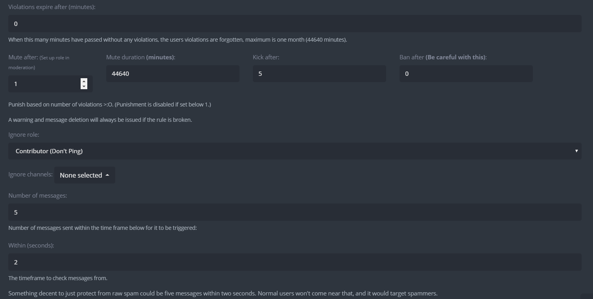



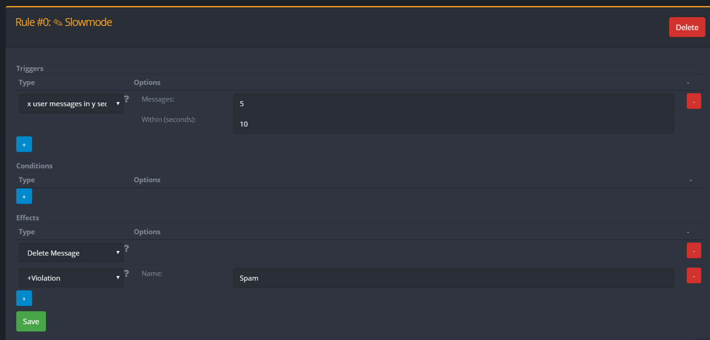



### Mass Mention



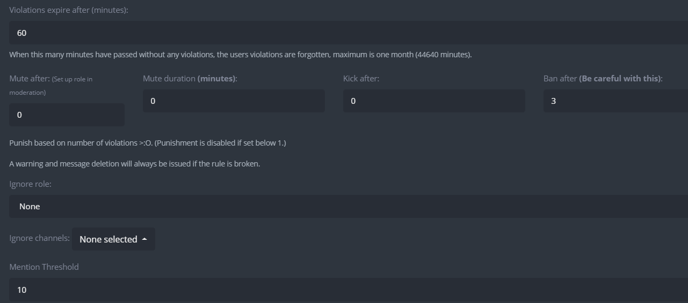



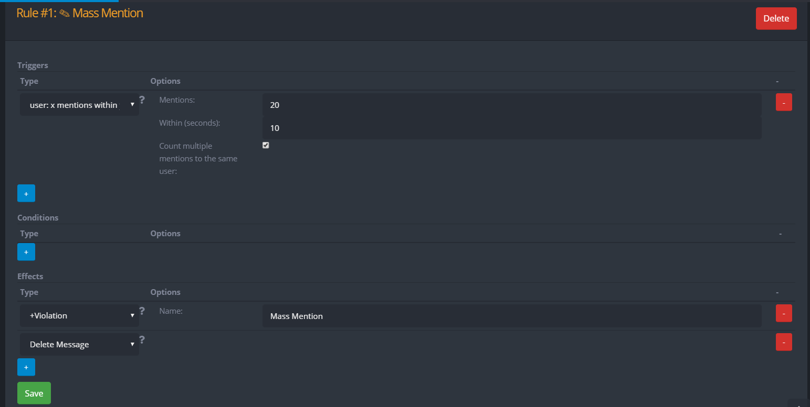



### Server Invite




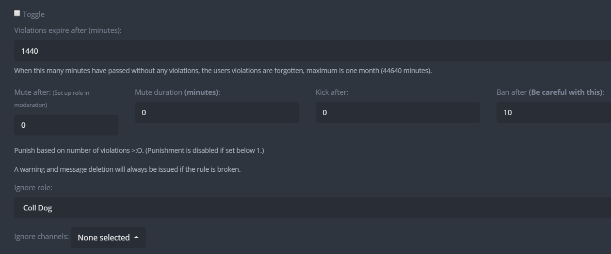



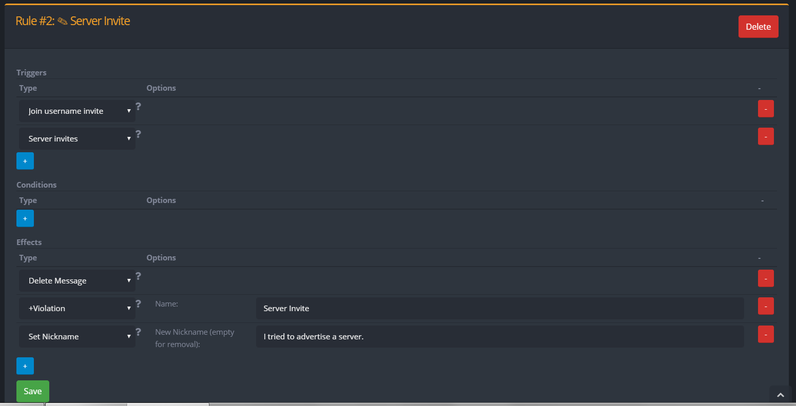



### Links



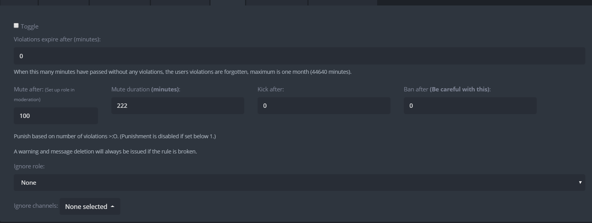



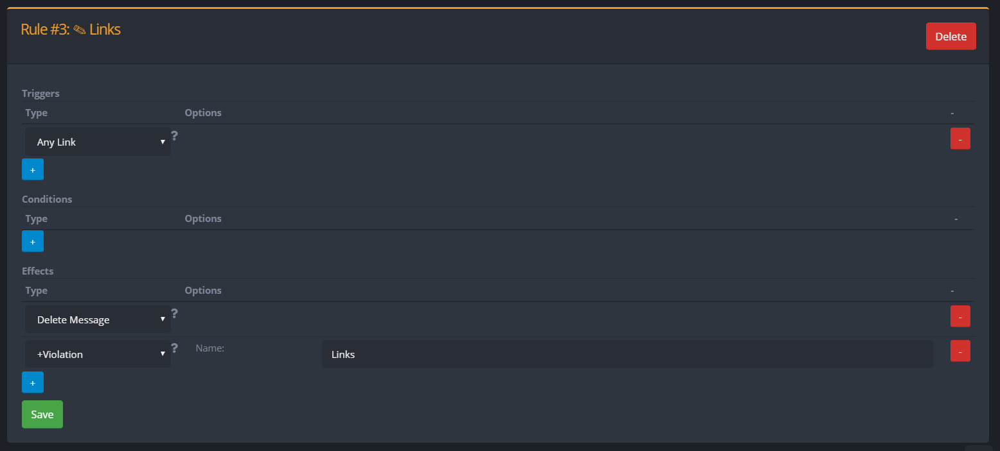



### Banned Words



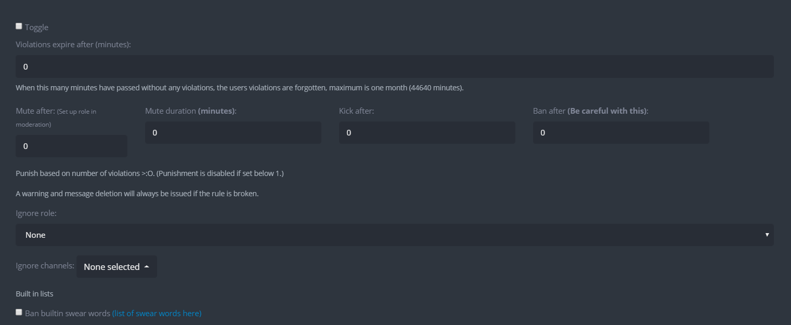



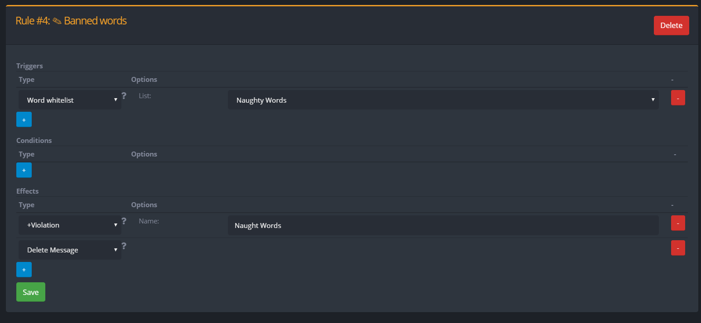



### Banned Websites



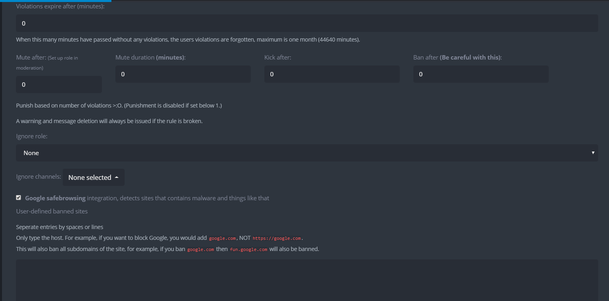



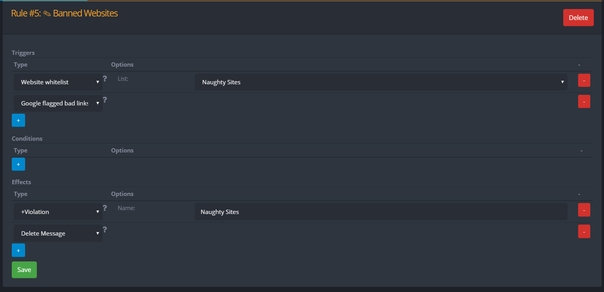



