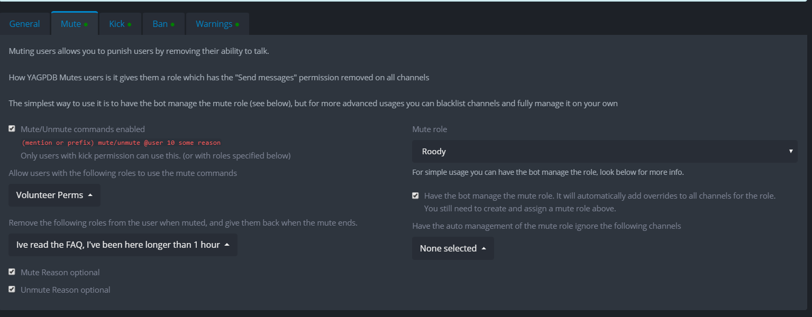

# Moderation

The moderation features YAGPDB provides are:

* Modlog that logs all the moderation actions.
* Generation of a message log for all mod action
  * For example: if you use the `-ban` command, the bot will also log the last 100 messages in the channel the command was executed, including deleted messages.
* Kick and ban commands
  * You can use the default message or create your own.
  * You can delete the last 100 messages of the user when they get kicked/banned.
* Mute
  * Assigns the mute role for a temporary duration.
  * You can enable to bot to set up the permissions for the mute role but you will still have to create the role yourself.
  * If you have any roles that conflict with the mute role, you can select roles to be remove when the mute is assigned and will be given back to them after the mute is done. 
* Clean/Clear
  * Removes last x messages, optional filtering args available. See below for more details and examples.
* Warnings
  * Assign a warning to a user, trackable through the bot. 

There is also a auto-moderation feature as well.



## Clean/Clear Syntax and examples

 **Syntax:** `-clean (Optional -ma [time]) (Optional -r "word") (Optional -i) (Optional @user) (num)` 

**Examples**  
  
`-clean 100`   
Cleans 100 most recent messages.  
`-clean -ma 2h 100`   
Cleans 100 messages sent in the last 2 hours.  
`-clean -r pineapple 100`  
Cleans 100 messages containing pineapple.  
`-clean -r pineapple -i 100`   
Cleans 100 messages containing pineapple, and ignoring case sensitivity .  
`-clean @user 100`   
Cleans 100 messages sent by @user.  
`-clean -ma 5h -r pineapple -i @user 100`   
Cleans 100 messages sent by @user in the last 5 hours containing pineapple, ignoring case sensitivity.

