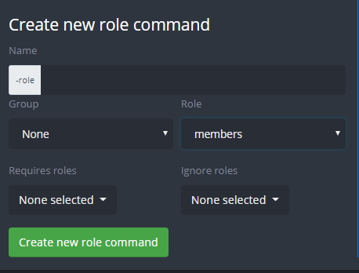
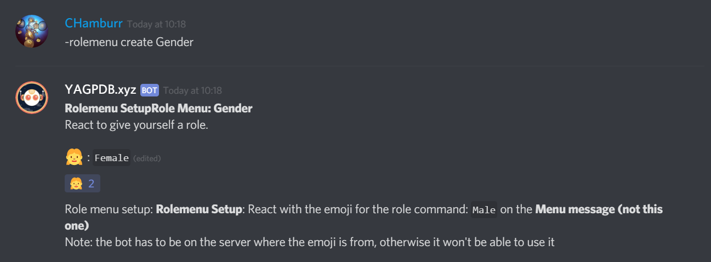
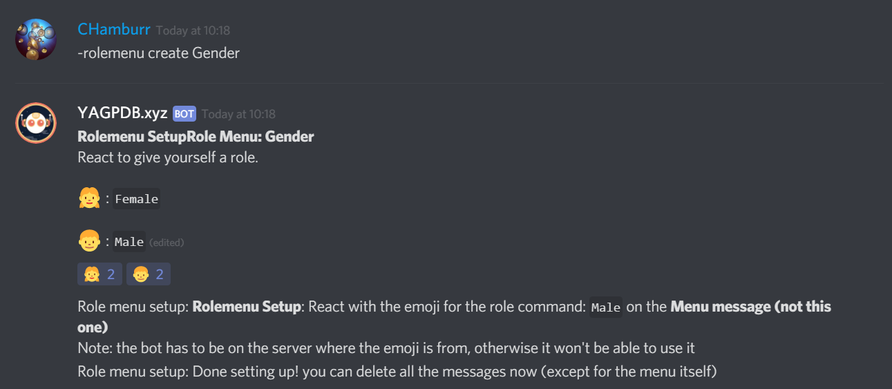

# Role Commands \(Self-assignable roles\)

## Roles


Make sure that the bot has the _manage role_ permissions and that the bot's role is **above** the role it is trying to assign


Simply give the role command a name and then select which role you want the bot to assign to the person. 

### Optional features


Do **NOT** make the require role or the ignore role, the role you are assigning.


**Require role**: Requires a person to have a certain role in order for them to give themselves this role.  
**Ignore role**: Ignore any person who has this role.  
**Group:** Put the role in a role group \(will be explained more further down\).

## Role Groups


Role groups are essential if you want to set up a role menu


Role groups are useful for applying restrictions on a group of roles such as only being able to have one or the other role etc. They're also essential if you want to create a role menu. To create one, simply give the role group a name and then select which mode you want the role group to use.

### The different modes

1. None: This mode does nothing other than checking against the roles required and ignored roles.
2. Single: They can only have 1 role in the group. \(e.g. for colors\)
3. Multiple: You can set the minimum and maximum number of roles a member can have in the group.

### Optional features


Do **NOT** make the required role or the ignored role the role you are assigning.


**Require role**: requires a person to have a certain role in order for them to give themselves this role.  
**Ignore role**: Ignore any person who has this role.  
**Mode**: Select between none, single, multiple to restrict the number of roles they can assign them themselves.

Role groups have additional options that can be enabled/disabled by selecting the corresponding checkbox such as:

* Requiring a user to have one of the following role at all time \(after initial assignment\).
* Removing the previous role when they assign themselves another role from the group. 

#### Example usage:

Say you have a server with 3 factions and want people to be able to assign their own faction when they join. That's simple enough all we have to do is:

* Create the 3 roles
* Create 3 role commands for those roles

Now everyone can assign themselves a faction! There are a couple of issues with this setup though:

1. You can assign yourself more than 1 faction.
2. People can freely jump between factions.

To fix these problems we can create a new group with the mode `Single` and assign the previous role commands to that group. Great! Now we can only have 1 faction! How can we solve jumping between factions then? You can enable the `Require 1 role in group` setting, now they can't remove roles in the group, and they can have max. 1 role in the group, so they can't jump around anymore!

### 

### Adding roles to the role group


Roles can only be assigned to one group. 


Refer back to the [optional features ](self-assignable-roles.md#optional-features)for roles and select the role group you want to assign the role to.

## Role Menu


Make sure you created your [role commands ](self-assignable-roles.md#roles)and assigned them a [role group](self-assignable-roles.md#role-groups) before starting. Role menu will **NOT** work if you have not done so. 


The role menu makes it possible to have people assign roles by adding reactions to a message.


A role menu can only support up to 20 roles due to the reaction limit discord places on messages. If your role group has more then twenty, the role menu will not work. 


To set up a role menu, the related roles **have to be added to a role group**, then you invoke the command `-rolemenu create Group_Name_Here`

The group mode and other restrictions from the role group and role still apply to the roles in the role menu.  
  
After you type in the command, you will be taken through the setup process. If you want to disable DM/create a custom message/add new role to your role menu, be sure to read until the end.

### Step by step tutorial


Make sure you created your [role commands ](self-assignable-roles.md#roles)and assigned them a [role group](self-assignable-roles.md#role-groups) before starting. Role menu will **NOT** work if you have not done so. 


Once you've made your role commands and assigned them to a role group,  
go to the channel in Discord where you want the role menu to be created. There you type `-rolemenu create Gender`.

Make sure to replace **Gender** with the name of your role group

As you can see the bot started creating the menu. It'll asks you to add the emoji for a role. In this case the role is the **Female** role. I'll react on the message with emote I want associated with the female role. 


Make sure to react on the original message \(The one with the other reaction\) If you add it to the other message of the bot, it won't do anything.


Now the bot wants you to react on the **first** message for the next role, in this case the **Male** role.

From now on people can start using the menu by clicking on the specific reaction.   
The unnecessary message will be automatically deleted in a couple of minutes.

### Custom message

To create a custom message for your role menu like event role menu you saw above, you will need to send a message. Then get the ID of the message by following the steps in [how to get a message ID](self-assignable-roles.md#how-to-get-a-message-id-desktop) and type in the following command, `-rolemenu create (group name) -m (message id)`. You would then complete the role menu like you would any normal role menu 

### Disabling DM confirmation

If you do not want the bot to send you a DM when you are given or removed from a role, type in the following command `-rolemenu update (message id) -nodm` 

After you have finish editing or creating your role menu, it will display whether the DM is enabled or not.

### Remove roles on reaction remove

Remove roles on reaction remove, this means instead of the old toggling mode, adding reactions will strictly give you the role, and removing reactions will only take away the role from you. **This mode will be on by default for new menus.** 

You can set old menus to use this flag using the command `rolemenu update (message id) -rr`

## Role Menu options

### Removing a role menu

If you want to remove a role menu from a message, you can type in `-rolemenu remove (message id)`  It will remove the rolemenu from a message. The message itself wont be deleted but the bot will now not do anything with reactions on that message. 

### Editing a role menu 

If you want to change the emote for one your reaction, you can do so by typing in `-rolemenu edit (message id)` After you type it the command it will ask you to react on the emote you want to change. You will need to go to the role menu and react on the emote you want to change. After you have reacted on the desired emote, it will ask you to react with your new emote on the role menu. 

### Resetting all reactions

If you edit your reaction emotes or simply want to give your emote a new clean slate. You can reset all the reactions by typing in`-rolemenu resetreactions (message id)`  It will remove all reactions on this menu and re-adds them, can be used to fix the order. 

### Updating a role menu

If you added a new role to your role group, you can update your role menu you can update it by typing in`-rolemenu update (message id)`and following the instructions given. If you removed a role, you will have to delete it and make a new one from scratch. 

## How to get a message ID \(Desktop\)


Make sure you have developer mode turned on in your discord settings.


To get the ID of the message you want to set the custom role menu on, click on the three dots on the far right hand side of the message and click on `Copy ID`

